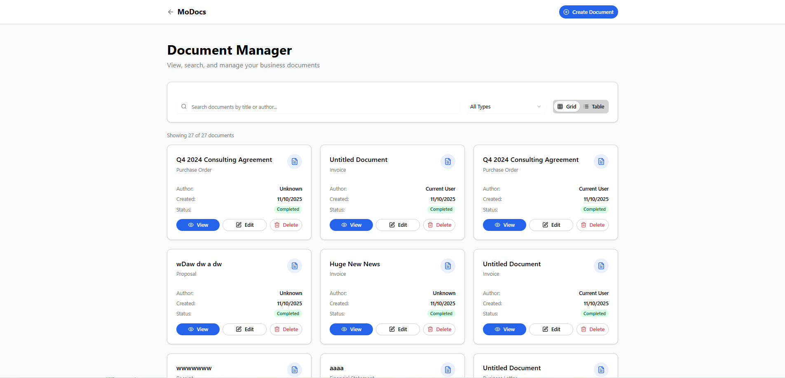
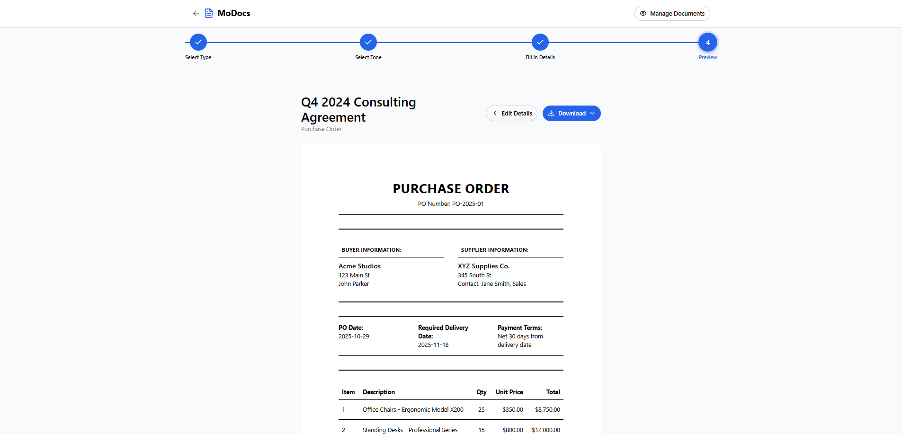

# MoDocs - AI-Driven Business Document Generator


## 📄 What MoDocs Does

MoDocs is an AI-driven platform that automates professional business document creation. It generates invoices, contracts, reports, proposals, and more using intelligent templates and user inputs.

MoDocs streamlines small to medium business operations by reducing manual paperwork, saving time, and improving consistency across essential documents.

## 🚀 Key Features

### 📝 Multi-Document Support
- **Purchase Orders** - Generate detailed procurement documents
- **Invoices** - Create professional billing statements
- **Proposals** - Craft compelling business proposals
- **Contracts** - Draft comprehensive agreements
- **Reports** - Generate business analytics and summaries
- **Financial Statements** - Create formal financial documents
- **Receipts** - Issue transaction confirmations
- **Custom Documents** - Build your own document types

### 🎨 Smart Document Creation
- **Guided Workflow** - 4-step wizard (Type → Tone → Details → Preview)
- **Tone Selection** - Professional, Friendly, or Formal writing styles
- **AI-Powered Generation** - Automatic content generation based on inputs
- **Real-Time Preview** - See your document before finalizing
- **Template System** - Pre-built templates for common document types

### 💾 Document Management
- **Persistent Storage** - All documents saved locally in browser
- **Search & Filter** - Find documents by title, type, or author
- **Grid & Table Views** - Multiple viewing options for your documents
- **Status Tracking** - Track In Progress vs Completed documents
- **Quick Actions** - View, Edit, and Delete documents with one click

### 📤 Export Options
- **PDF Download** - Export documents as professional PDFs
- **JSON Export** - Download document data for backup/integration
- **Client-Side Generation** - Fast, reliable PDF creation in-browser

### Document Manager
View, search, and manage all your business documents in one place.



### Document Creation Wizard
Step-by-step guided process for creating professional documents.



## 🛠️ Setup and Installation

### Prerequisites
- Node.js 18+ or npm
- Git

### Installation Steps

1. **Clone the repository**
```bash
git clone https://github.com/aymenawol/MoDocs.git
cd MoDocs
```

2. **Install dependencies**
```bash
npm install
```

3. **Run the development server**
```bash
npm run dev
```

4. **Open in browser**
Navigate to [http://localhost:3000](http://localhost:3000)

### Build for Production

```bash
npm run build
npm start
```

## 📋 Usage Guide

### Creating Your First Document

1. **Navigate to MoDocs** - Click "Create Document" from the home page
2. **Select Document Type** - Choose from Purchase Order, Invoice, Proposal, etc.
3. **Choose Tone** - Pick Professional, Friendly, or Formal
4. **Fill in Details** - Complete the form fields specific to your document type
5. **Generate Document** - Click "Generate" to create your document with AI
6. **Preview & Edit** - Review the generated content and make adjustments
7. **Download** - Export as PDF or JSON

### Managing Documents

- **View Documents** - Click "Manage Documents" to see all created documents
- **Search** - Use the search bar to find documents by title or author
- **Filter** - Filter by document type (All Types, Invoice, Contract, etc.)
- **Grid/Table View** - Toggle between grid cards and table layout
- **Edit** - Click "Edit" on any document to modify it
- **Delete** - Remove documents you no longer need

## 🏗️ Technology Stack

- **Framework**: Next.js 16 (App Router)
- **Language**: TypeScript
- **Styling**: Tailwind CSS
- **UI Components**: shadcn/ui + Radix UI
- **Icons**: Lucide React
- **PDF Generation**: jsPDF + html2canvas (client-side)
- **Storage**: Browser localStorage (no backend required)
- **Deployment**: Vercel-ready

## ⚠️ Current Limitations & Assumptions

### Assumptions
- **Browser Storage**: Documents are stored in browser's localStorage (limit ~5-10MB)
- **Single User**: Designed for individual use, no multi-user authentication
- **Client-Side Only**: No server-side processing or database
- **Simulated AI**: Current version uses placeholder generation (3-second delay) rather than real AI

### Limitations
- **Data Persistence**: Documents are lost if browser cache is cleared
- **No Cloud Sync**: Cannot access documents from different devices
- **No Collaboration**: Single-user editing, no real-time collaboration
- **Storage Limits**: Browser storage quota limits total document capacity
- **No AI Integration**: Placeholder content generation (not connected to OpenAI/Claude)
- **No User Accounts**: No authentication or user management system


## 📁 Project Structure

```
MoDocs/
├── app/                          # Next.js App Router pages
│   ├── modocs/
│   │   ├── page.tsx             # Landing page
│   │   ├── create/page.tsx      # Document creation wizard
│   │   └── view/page.tsx        # Document manager
│   ├── layout.tsx               # Root layout
│   └── globals.css              # Global styles
├── components/
│   ├── ui/                      # shadcn/ui components
│   ├── document-preview.tsx     # Document preview renderer
│   └── theme-provider.tsx       # Dark mode support
├── lib/
│   ├── document-templates.ts    # Document content templates
│   ├── document-types.ts        # Document type definitions
│   ├── validation.ts            # Form validation logic
│   └── utils.ts                 # Utility functions
├── public/                      # Static assets
└── package.json                 # Dependencies and scripts
```

## 🤝 Contributing

This is a prototype project. Contributions, issues, and feature requests are welcome!

## 📄 License

This project is for educational/demonstration purposes.

## 👤 Author

**Aymen Awol**
- GitHub: [@aymenawol](https://github.com/aymenawol)

---

Built with ❤️ for streamlining business document creation
